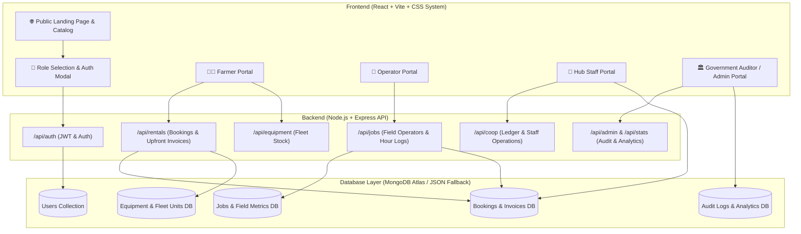
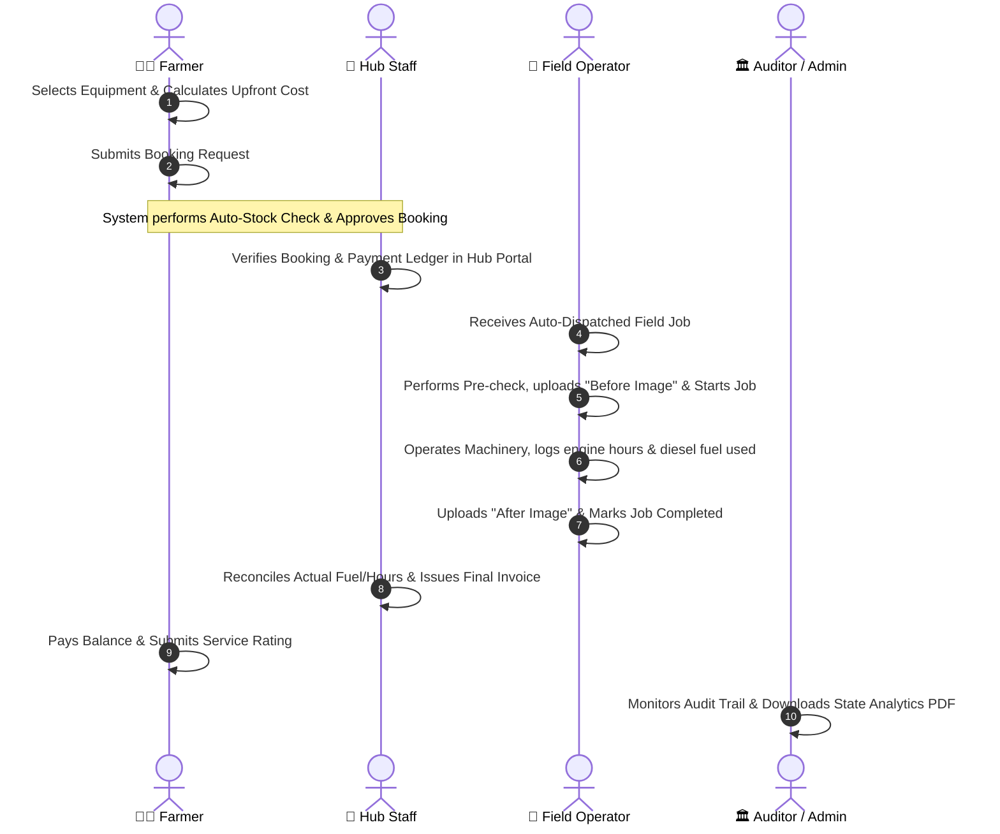

# 🌾 AgriRentGov - Smart Agriculture Equipment Rental Platform
## Complete Project Walkthrough & Role-Based Work Processes

---

## 📌 1. Project Executive Overview

**AgriRentGov** is a state-of-the-art agricultural equipment leasing and management platform tailored for cooperative hubs across **Tamil Nadu**. It connects farmers directly with government-backed cooperative machinery hubs, allowing seamless rental of Mahindra tractors, combine harvesters, rotavators, seed drills, and power tillers with transparent upfront billing, real-time job dispatches, and state-level audit metrics.



---

## 🛠️ 2. Technology Stack & Key Architectural Principles

| Category | Technology | Description |
| :--- | :--- | :--- |
| **Frontend UI** | React 18, Vite | High-performance SPA with lazy-loaded role portals |
| **Styling** | Vanilla CSS Tokens & Dynamic Themes | Dark aesthetic, CSS variables, glassmorphism, responsive grid |
| **Icons & Visuals** | Lucide React | Clean, intuitive icon set for domain-specific agricultural tools |
| **Backend Framework** | Node.js, Express.js | RESTful API server with JWT authentication & proxy integration |
| **Database** | MongoDB Atlas / Mongoose | Schema validation, sub-document unit tracking & local JSON fallback |
| **Reports & Analytics** | Recharts, PDF Generation | Visual charts & downloadable government analytics PDF reports |

---

## 🔄 3. End-to-End Rental Lifecycle

The lifecycle of an equipment rental flows through the 4 user roles smoothly:



---

## 👥 4. Role-by-Role Work Processes & Feature Walkthrough

### 👨‍🌾 Role 1: Farmer
**Primary Objective:** Easily discover, calculate cost, and rent modern agricultural equipment from local cooperative hubs to increase crop yield without capital expenditure.

```
[Login / Register] ➔ [Select District/Taluk] ➔ [View Equipment Stock] ➔ [Upfront Cost Calculation] ➔ [Instant Auto-Booking] ➔ [Track Dispatch & Pay]
```

#### Step-by-Step Work Process:
1. **Authentication & Smart Profile:**
   - Registers or logs in using mobile number and district ([`RoleLoginPage.jsx`](file:///c:/Users/bhara/Downloads/smart-agri-equipment-rental-main/smart-agri-equipment-rental-main/frontend/src/components/RoleLoginPage.jsx)).
   - Profile automatically stores `Farmer ID`, `Mobile`, `District`, `Taluk`, and `Farm Address` so forms auto-populate.
2. **Catalog Browsing & Location Filtering:**
   - Views machinery catalog ([`FarmerEquipmentView.jsx`](file:///c:/Users/bhara/Downloads/smart-agri-equipment-rental-main/smart-agri-equipment-rental-main/frontend/src/components/farmer/FarmerEquipmentView.jsx)).
   - Filters by District (e.g., Coimbatore, Madurai, Salem, Thanjavur) and Taluk hubs to find nearby machinery.
3. **Upfront Cost Calculation & Booking:**
   - Selects dates and duration (days/hours) in [`RentalModal.jsx`](file:///c:/Users/bhara/Downloads/smart-agri-equipment-rental-main/smart-agri-equipment-rental-main/frontend/src/components/RentalModal.jsx).
   - System calculates base daily rate + estimated diesel fuel requirements.
4. **Auto-Approval & Invoice Receipt:**
   - If stock is available (up to 15 units per equipment type per hub), system instantly sets booking status to `Approved`.
   - Generates a **Tentative Upfront Invoice** with itemized breakdown.
5. **Real-time Tracking & Feedback:**
   - Tracks order dispatch status in [`FarmerBookingsView.jsx`](file:///c:/Users/bhara/Downloads/smart-agri-equipment-rental-main/smart-agri-equipment-rental-main/frontend/src/components/farmer/FarmerBookingsView.jsx).
   - Upon job completion, pays remaining balance and submits a star rating + feedback.

---

### 🚜 Role 2: Equipment Operator
**Primary Objective:** Accept auto-assigned field jobs, travel to specified farm plots, operate heavy machinery safely, and accurately log working hours and fuel consumption.

```
[View Operator Dashboard] ➔ [Accept Assigned Job] ➔ [Upload Pre-Operation Image] ➔ [Execute Field Work] ➔ [Log Fuel & Hours] ➔ [Upload Post-Operation Image & Complete]
```

#### Step-by-Step Work Process:
1. **Job Dispatch Alert:**
   - Logs into [`OperatorPortal.jsx`](file:///c:/Users/bhara/Downloads/smart-agri-equipment-rental-main/smart-agri-equipment-rental-main/frontend/src/components/operator/OperatorPortal.jsx).
   - Sees list of assigned dispatch tasks auto-routed based on proximity and assigned machinery unit.
2. **Pre-Operation Checklist:**
   - Navigates to job details (Farmer name, phone number, location address, target equipment unit serial number).
   - Starts job (status changes to `Started`), inspects machine condition, and uploads a **Before Image**.
3. **Field Operation & Meter Logging:**
   - Operates the tractor/harvester/rotavator at the farmer's field.
   - Monitors engine start hours vs end hours and diesel consumed in liters.
4. **Job Completion & Telemetry Submission:**
   - Enters final engine hours, diesel spent, work completed notes, and uploads an **After Image**.
   - Marks job as `Completed`.
   - The system updates equipment cumulative usage hours and triggers final invoice reconciliation.

---

### 🏢 Role 3: Cooperative Staff / Hub Manager
**Primary Objective:** Oversee daily hub inventory, verify customer accounts, process upfront/final billing payments, manage unit assignments, and handle account suspensions.

```
[Monitor Hub Overview] ➔ [Manage Inventory Fleet] ➔ [Process Upfront & Final Ledger] ➔ [Review User Suspensions Ledger] ➔ [Dispatch Oversight]
```

#### Step-by-Step Work Process:
1. **Hub Dashboard Control:**
   - Opens [`CoopPortal.jsx`](file:///c:/Users/bhara/Downloads/smart-agri-equipment-rental-main/smart-agri-equipment-rental-main/frontend/src/components/cooperative/CoopPortal.jsx).
   - Monitors active rentals, available units, total revenue collected, and pending dispatches for the local hub.
2. **Inventory Stock Management:**
   - Adds new machinery using [`AddEquipmentModal.jsx`](file:///c:/Users/bhara/Downloads/smart-agri-equipment-rental-main/smart-agri-equipment-rental-main/frontend/src/components/cooperative/AddEquipmentModal.jsx) or edits rental rates and operator assignments via [`EditEquipmentModal.jsx`](file:///c:/Users/bhara/Downloads/smart-agri-equipment-rental-main/smart-agri-equipment-rental-main/frontend/src/components/cooperative/EditEquipmentModal.jsx).
   - Manages individual unit serials and availability status.
3. **Upfront & Final Billing Ledger:**
   - Processes payment collections (Cash, UPI, Bank Transfer) directly in the billing ledger.
   - Reconciles tentative invoices against operator-logged actual fuel usage to issue final invoices.
4. **User Account Oversight & Suspensions Ledger:**
   - Reviews farmer registration applications in [`FarmerVerificationView.jsx`](file:///c:/Users/bhara/Downloads/smart-agri-equipment-rental-main/smart-agri-equipment-rental-main/frontend/src/components/cooperative/FarmerVerificationView.jsx).
   - Searches and filters suspended or blocked accounts by name, email, role, or hub.

---

### 🏛️ Role 4: State Government Auditor / Admin
**Primary Objective:** Ensure policy compliance, analyze statewide rental revenue, compare district performance, audit operational security logs, and export printable official PDF summaries.

```
[Statewide Governance Metrics] ➔ [District Revenue Analytics] ➔ [System-Wide Audit Logs] ➔ [Generate & Download PDF Reports]
```

#### Step-by-Step Work Process:
1. **Statewide Governance Overview:**
   - Accesses [`AdminPortal.jsx`](file:///c:/Users/bhara/Downloads/smart-agri-equipment-rental-main/smart-agri-equipment-rental-main/frontend/src/components/admin/AdminPortal.jsx).
   - Views high-level KPI metric cards: Total Platform Revenue, Total Rentals, Fleet Utilization %, Active Cooperative Hubs.
2. **District Comparison & Category Share Analytics:**
   - Analyzes bar charts comparing rental utilization across Tamil Nadu districts (Coimbatore, Salem, Thanjavur, Madurai, etc.).
   - Reviews pie charts breaking down revenue share by equipment type (Tractor vs Harvester vs Rotavator).
3. **System Audit Trail & Security Oversight:**
   - Reviews immutable audit logs capturing every critical system event (login attempts, price adjustments, booking approvals, status changes) along with user roles, IP addresses, and timestamps.
4. **Downloadable Analytics PDF Reports:**
   - Generates print-ready PDF reports formatted for department meetings and official government auditing.

---

## 📁 5. Repository File Map & Key Locations

```
smart-agri-equipment-rental-main/
├── PROJECT_WALKTHROUGH.md   # Project Walkthrough & Role Work Processes Documentation
├── backend/
│   ├── db.js                 # Database Schemas (User, Equipment, Unit, Booking, Job, Invoice, AuditLog) & Seeding Logic
│   ├── server.js             # Express API Server Entrypoint & Proxy Handler
│   └── routes/
│       ├── authRoutes.js     # User registration, JWT login & password verification
│       ├── equipmentRoutes.js# Equipment catalog, district filters & unit availability
│       ├── rentalRoutes.js   # Booking auto-approval, upfront calculations & tentative invoices
│       ├── jobRoutes.js      # Operator dispatch tasks, photo uploads & engine hour logging
│       ├── coopRoutes.js     # Cooperative staff billing ledger & inventory control
│       ├── adminRoutes.js    # System-wide metrics, audit logs & PDF report generator
│       └── statsRoutes.js    # District-level aggregated statistics
└── frontend/
    └── src/
        ├── App.jsx           # Main Navigation Router & Lazy Portal Switcher
        ├── api.js            # Axios/Fetch API client functions connecting to backend
        └── components/
            ├── Header.jsx & Hero.jsx            # Public Header & Hero Banner
            ├── EquipmentCatalog.jsx            # Interactive catalog preview with modal triggers
            ├── RentalModal.jsx                 # Upfront rental cost calculator & booking modal
            ├── RoleSelectionPage.jsx           # Role selector cards
            ├── RoleLoginPage.jsx               # Universal login portal
            ├── farmer/
            │   ├── FarmerPortal.jsx            # Main Farmer layout wrapper
            │   ├── FarmerEquipmentView.jsx     # District-filtered equipment finder
            │   ├── FarmerBookingsView.jsx      # Active rentals, dispatches & invoice view
            │   └── FarmerComplaintsView.jsx    # Support & feedback submission
            ├── operator/
            │   └── OperatorPortal.jsx          # Field operator dispatch & hour/fuel logger
            ├── cooperative/
            │   ├── CoopPortal.jsx              # Hub management, billing ledger & inventory control
            │   ├── AddEquipmentModal.jsx       # Modal to add new machinery fleet
            │   └── FarmerVerificationView.jsx  # User account approval & suspension ledger
            └── admin/
                └── AdminPortal.jsx             # State auditor dashboard, charts & PDF reports
```

---

## 🎯 Summary Checklist of System Strengths
- ✅ **Upfront Transparency:** Upfront booking cost calculation including estimated diesel fuel costs.
- ✅ **Auto-Dispatch Workflow:** Direct integration between Farmer booking -> Staff approval -> Operator job assignment.
- ✅ **Engine Meter Accountability:** Operator pre-check (Before image) and post-check (After image) with exact hours & fuel logging.
- ✅ **Government Compliance:** Comprehensive audit trail, district comparison analytics, and exportable PDF reports.
